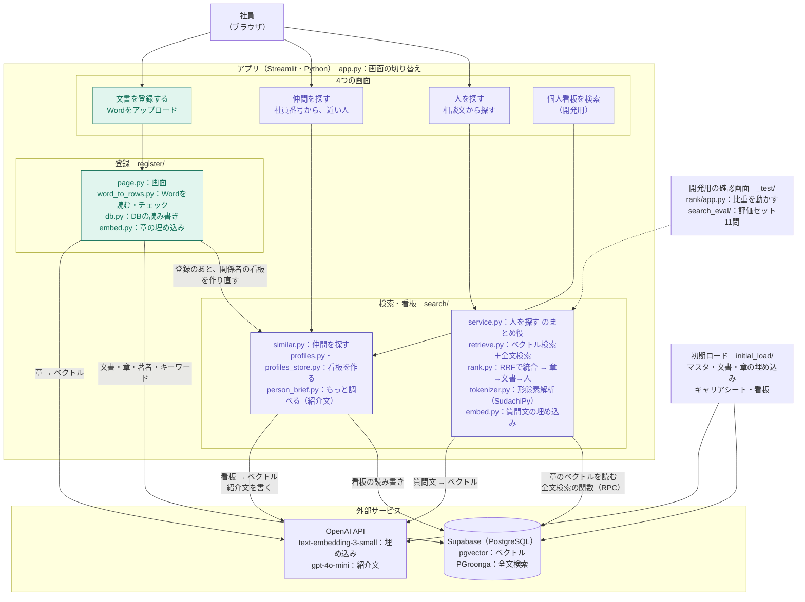

# アーキテクチャ図

隠れ出る杭検索を、どんな部品（プログラム・サービス）で組み立てているかをまとめた図です。
データの流れは [data_flow.md](data_flow.md)、表の中身は [テーブル定義書.md](テーブル定義書.md) を見てください。
同じ内容を draw.io でも描いています（[architecture.drawio](architecture.drawio)。発表資料用に見た目を直せます。ページは「アーキテクチャ」と「データフロー」の2枚）。

- 更新日：2026-10-10（DB v5、検索・仲間を探す・個人看板の完成を反映）
- 色：緑＝登録（まよりん）／紫＝検索・看板（ほりえもん）／灰＝共通・外部サービス
- 点線の枠は、表だけ作って、まだ使っていない部分（予定）です

## 1. 構成

## 2. 部品の一覧

| 部品 | 役割 | 担当 | 状態 |
|---|---|---|---|
| app.py | 入口。サイドバーで4つの画面を切り替える | ほりえもん | 稼働中 |
| 人を探す | 相談文から、似た経験を持つ人を「実績のある人」と「隠れた杭」の2つの枠で出す | ほりえもん | 稼働中 |
| 仲間を探す | 社員番号を入れると、看板が近い人（考え方や関心が似ている人）を出す | ほりえもん | 稼働中 |
| もっと調べる | 選んだ人の看板とキャリアシートから、AIが紹介文を書く。書いた事実に出典を付けさせ、プログラムで確かめる | ほりえもん | 稼働中 |
| 個人看板を検索（開発用） | 社員番号から、その人の看板の中身を見る。本番では出さない | ほりえもん | 稼働中 |
| 登録（register/） | Wordをチェックして、文書・章・著者・キーワードをDBに登録し、章を埋め込む。そのあと関係者の看板を作り直し、検索のキャッシュを消す（すぐ検索に出る） | まよりん | 稼働中 |
| 検索（search/） | ベクトル検索と全文検索を RRF でまとめ、章 → 文書 → 人の順に点数を集める | ほりえもん | 稼働中 |
| 看板（profiles・profile_notes） | 人ごとに、文書のノートとキャリアシートを並べた文章と、その埋め込み。画面には出さず、仲間を探す・もっと調べるに使う | ほりえもん | 稼働中 |
| Supabase | データベース（PostgreSQL）。pgvector で埋め込みを、PGroonga で全文検索の索引を持つ | － | 稼働中 |
| OpenAI API | 章・質問文・看板をベクトルにする（text-embedding-3-small、1536次元）。紹介文を書く（gpt-4o-mini） | － | 稼働中 |
| SudachiPy | 日本語を単語に分ける。登録のとき（全文検索の列・キーワード）と検索のとき（質問文）に使う | ほりえもん | 稼働中 |
| 初期ロード（initial_load/） | マスタ・文書（db_load_673.json と追加分 db_load_add_*.json）・章の埋め込み・キャリアシート・看板を入れる | ほりえもん・まよりん | 実行済み |
| 開発用の確認画面（_test/rank/app.py） | 全文の比重・役割の重みなどを動かし、順位と評価セット11問の点数がどう変わるかを見る。既定値を決めるための画面 | ほりえもん | 稼働中 |
| .env | 接続情報とAPIキー（SUPABASE_URL・SUPABASE_KEY・OPENAI_API_KEY）。`.gitignore` 済みでGitには上げない | 各自 | － |

## 3. DBの表（2026-10-10 時点の件数。ナレッジの拡充のあと）

| まとまり | 表 | 件数 | 何が入っているか |
|---|---|---|---|
| マスタ | departments | 41 | 部署 |
| マスタ | employees | 772 | 社員 |
| 事実データ | documents | 1,483 | 文書（改善提案 593／PJ文書 300／アイデア投稿 590） |
| 事実データ | document_sections | 6,335 | 章の本文・全文検索の列（body_tokens）・埋め込み。検索の単位 |
| 事実データ | document_authors | 2,023 | 誰がどの役割で文書に関わったか |
| 事実データ | document_keywords | 11,869 | 文書のキーワード（検索結果に出す） |
| AI生成物 | profiles | 767 | 看板の文章と埋め込み（1人1行） |
| AI生成物 | profile_notes | 3,014 | 看板のノート（文書の抜粋 1,775／キャリアシート 1,239・367人分） |
| 予定（未使用） | tags・cluster_runs・clusters・cluster_members・app_users・interests | 0 | タグ、クラスタ分析、ログイン、関心の記録 |

## 4. 未定のこと

- アプリをどこで動かすか（各自のPCだけか、Streamlit Community Cloud などで公開するか）。公開する場合は、接続情報を `.env` ではなく、公開先の秘密情報の設定（`st.secrets` など）に置く
- 登録タブでアイデア投稿（IDEA-）を扱うか。今は初期ロードでだけ入れている
- キャリアシートを画面から登録・更新するか。今はモックのJSONを初期ロードで入れている
- 予定の表（タグ・クラスタ・ログイン・関心の記録）を、発表までに使うか
