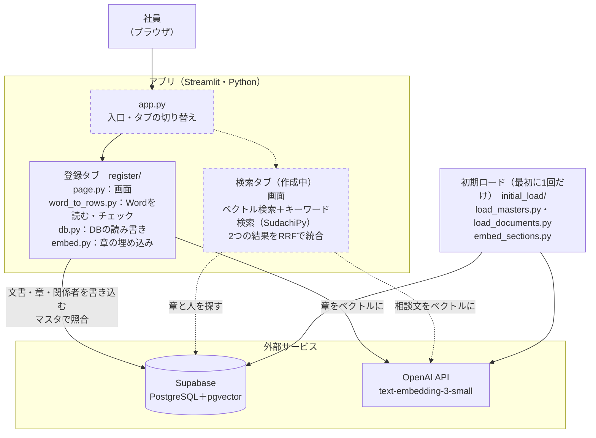

# アーキテクチャ図

隠れ出る杭検索を、どんな部品（プログラム・サービス）で組み立てているかをまとめた図です。
データの流れは [data_flow.md](data_flow.md) を見てください。
同じ内容を draw.io でも描いています（[architecture.drawio](architecture.drawio)。ER図と同じ配色で、発表資料用に見た目を直せます）。
点線の枠は、まだ作っていない部分（予定）です。

- 更新日：2026-09-30
- 登録タブ：まよりん（実装済み）／検索タブ：ほりえもん（作成中）

## 構成

## 部品の一覧

| 部品 | 役割 | 担当 | 状態 |
|---|---|---|---|
| Streamlit | 画面を作る（Pythonだけで書ける） | － | 採用済み |
| app.py | 入口。登録タブと検索タブを切り替える | 相談中 | 未作成（モックは `_test/UI/app.py`） |
| 登録タブ（register/） | Wordをチェックして、DBに登録し、章を埋め込む | まよりん | 実装済み |
| 検索タブ | 相談文から、似た経験を持つ人を探す | ほりえもん | 作成中 |
| Supabase | データベース（PostgreSQL）。pgvectorで埋め込みを保存・検索する。テーブルは documents・document_sections・document_authors・employees・departments など | － | 稼働中 |
| OpenAI API | 章と相談文をベクトルにする（text-embedding-3-small、1536次元） | － | 稼働中 |
| SudachiPy | 日本語を単語に分ける（キーワード検索用） | ほりえもん | 作成中 |
| 初期ロード（initial_load/） | マスタと373件の文書を入れ、章を埋め込む | まよりん | 実行済み |
| .env | 接続情報とAPIキー（SUPABASE_URL・SUPABASE_KEY・OPENAI_API_KEY）を置く。アプリと初期ロードの両方が読む。`.gitignore` 済みでGitには上げない | 各自 | － |

## 未定のこと

- アプリをどこで動かすか（各自のPCだけか、Streamlit Community Cloud などで公開するか）。公開する場合は、接続情報を `.env` ではなく、公開先の秘密情報の設定（`st.secrets` など）に置く
- app.py の置き場所と構成（登録タブは `from register.page import show` で呼べる）
- 推薦理由を文章で作るか（モックの「推薦理由を見る」）。作る場合は、OpenAIの文章生成のAPIも使う
- キーワード抽出（SudachiPy）を、登録のときに行うか、検索のときに行うか
