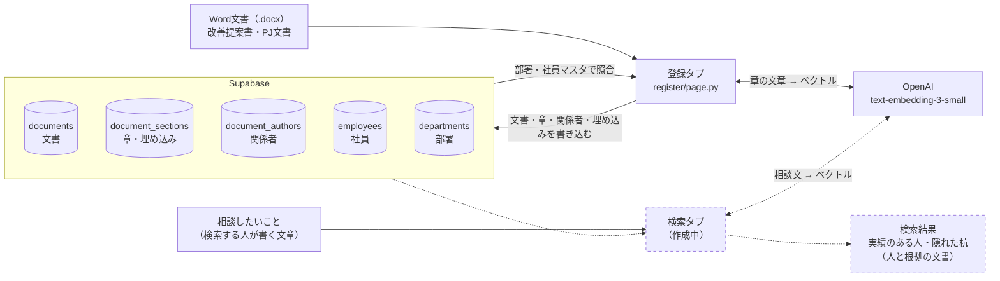
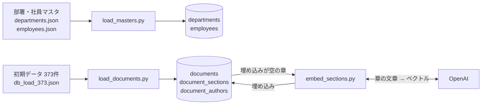
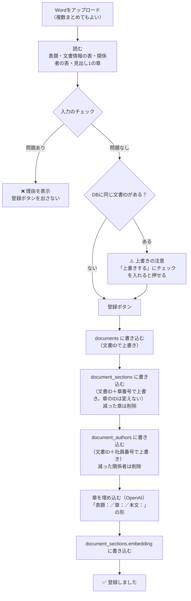

# データフロー図

隠れ出る杭検索で、データがどこから来て、どこに入り、どう使われるかをまとめた図です。
点線の枠は、まだ作っていない部分（予定）です。

- 更新日：2026-09-30
- 登録タブ：まよりん（実装済み）／検索タブ：ほりえもん（作成中）

## 1. 全体（普段の使い方）

## 2. 初期ロード（最初に1回だけ。実行済み）

## 3. 登録タブ（Wordを登録する流れ）

入力のチェックで見ている内容：

- ファイルの形式とサイズ（10MBまで）、文書IDの形（`KZ-2026-0001` など）
- 必須項目、日付の形、提案区分・判定・状態の値（今のDBにある値だけ）
- 部署と社員番号がマスタにあるか、氏名がマスタと違わないか
- 章の名前（役割が決まっている章だけ）、本文が空でないか
- 同時に入れた文書どうしで文書IDが重なっていないか

## 4. Wordの項目と、入るテーブル

| Wordの場所 | 入るテーブル | 主な列 |
|---|---|---|
| 表題、文書情報の表 | documents | doc_id、doc_type、doc_category、title、submitted_at、result、pj_status、owner_dept_id など |
| 見出し1で区切った章 | document_sections | section_no、section_name、section_role、body、embedding |
| 提案者（体制）の表 | document_authors | emp_no、role、dept_id_at_time |

章の名前と役割の対応：

| 種類 | 章の名前 → 役割 |
|---|---|
| 改善提案 | 現状→背景／問題点→課題意識／提案内容→行動案／期待効果→目標／実施上の課題→実施上の課題 |
| PJ文書 | 背景→背景／目的→目的／実施内容→行動／成果→成果 |

## 未定のこと

- アイデア投稿（`doc_type = idea`）の取り込み：仕様を相談中
- 登録のときのキーワード抽出（SudachiPy）：画面のモックにはあるが、登録タブでは未実装。検索側とどこで行うかを相談する
- 検索タブの中身（ベクトル検索とキーワード検索の組み合わせ、推薦理由の作り方）：ほりえもんさんが作成中
