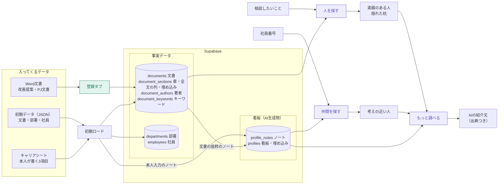
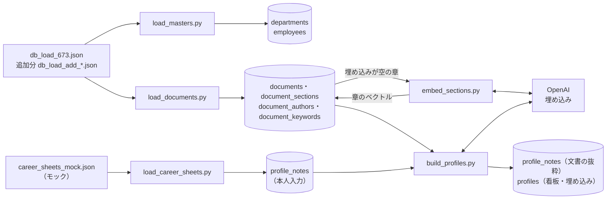
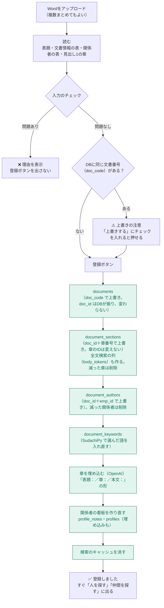
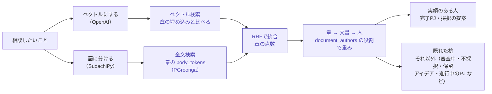
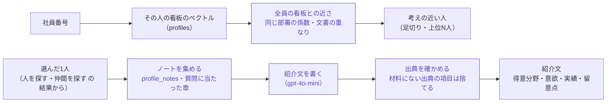

# データフロー図

隠れ出る杭検索で、データがどこから来て、どこに入り、どう使われるかをまとめた図です。
部品の構成は [architecture.md](architecture.md)、点数の計算の詳しい中身は [検索アルゴリズム解説.md](検索アルゴリズム解説.md)・[仲間を探す機能アルゴリズム解説.md](仲間を探す機能アルゴリズム解説.md) を見てください。

- 更新日：2026-10-10（DB v5、検索・仲間を探す・個人看板の完成を反映）
- 色：緑＝登録（まよりん）／紫＝検索・看板（ほりえもん）

## 1. 全体

入ってくるデータは3種類（文書・キャリアシート・マスタ）。DBの中で「事実データ」から「看板」を作り、3つの使い方（人を探す・仲間を探す・もっと調べる）で読む。

## 2. 初期ロード（最初に1回。実行済み）

順番：マスタ → 文書 → 章の埋め込み → キャリアシート → 看板。看板は文書とキャリアシートの両方から作るので、最後に作る。

## 3. 登録タブ（Wordを1件ずつ足す）

入力のチェックで見ている内容：

- ファイルの形式とサイズ（10MBまで）、文書番号の形（`KZ-2026-0001` など）
- DBに同じ文書番号があるか（あれば上書きの確認）、同時に入れた文書どうしで番号が重なっていないか
- 必須項目、日付の形、提案区分・判定・状態の値
- 文字数の上限（表題200字・判定理由500字・章名50字・本文5000字）、判定と判定日・状態と終了日の組み合わせ
- 部署と社員番号がマスタにあるか、氏名がマスタと違わないか
- 章の名前（役割が決まっている章だけ）、本文が空でないか

## 4. 人を探す（相談文から）

起動したときに、章の埋め込み・文書・著者・社員をDBからまとめて読み、手元に置いておく（キャッシュ）。登録タブで文書を足すと、このキャッシュを消して読み直す。

## 5. 仲間を探す・もっと調べる（看板から）

看板の文章そのものは画面に出さない（非公開のメモ）。紹介文は、ボタンを押したときだけ作る。

## 6. Wordの項目と、入るテーブル

| Wordの場所 | 入るテーブル | 主な列 |
|---|---|---|
| 表題、文書情報の表 | documents | doc_code（Wordの「文書ID」）、doc_type、doc_category、title、submitted_at、result、pj_status、owner_dept_id など |
| 見出し1で区切った章 | document_sections | section_no、section_name、section_role、body、body_tokens、embedding |
| 提案者（体制）の表 | document_authors | emp_id（社員番号から引く）、role、dept_id_at_time |
| 表題と全章の本文 | document_keywords | keyword、count |

章の名前と役割の対応：

| 種類 | 章の名前 → 役割 |
|---|---|
| 改善提案 | 現状→背景／問題点→課題意識／提案内容→行動案／期待効果→目標／実施上の課題→実施上の課題 |
| PJ文書 | 背景→背景／目的→目的／実施内容→行動／成果→成果 |

## 7. 未定のこと

- 登録タブでアイデア投稿（IDEA-）を扱うか。今は初期ロードでだけ入れている
- キャリアシートを画面から登録・更新するか。今はモックのJSONを初期ロードで入れている
- 看板のノートを、抜粋から要約（GPT）に変えるか。列（body_source＝要約）は用意済み
