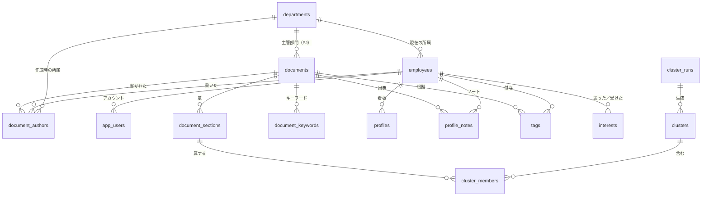

# 隠れ出る杭検索 テーブル定義書（スキーマv5）

> このファイルは `docs/make_table_definitions_md.py` が、定義書のxlsxから自動で作ります。直すときは、xlsxを直してから作り直してください。

Supabase（PostgreSQL）。件数はモックデータ（db_load_673.json）の行数。0件のテーブルは、アプリの利用や分析で後から作られる。黄色の行はv5で追加・変更した項目。

## 表どうしの関係

## 表の一覧

| No. | 論理名 | 物理名 | 説明 | 主キー | 件数（モック） |
|---|---|---|---|---|---|
| 1 | [部門](#departments) | `departments` | 部門のマスタ。工場・本社・支店の部署 | dept_id | 41 |
| 2 | [社員](#employees) | `employees` | 社員のマスタ | emp_id | 772 |
| 3 | [文書](#documents) | `documents` | 提案書・PJ文書・アイデア投稿の1件ごとの情報。種類によって使う列が違う | doc_id | 673 |
| 4 | [文書の章](#document_sections) | `document_sections` | 文書を章ごとに分けた本文。検索の単位 | section_id | 2835 |
| 5 | [文書の著者](#document_authors) | `document_authors` | 文書と社員の関係。誰がどの役割で関わったか | doc_id, emp_id | 823 |
| 6 | [文書のキーワード](#document_keywords) | `document_keywords` | 文書ごとのキーワード。検索結果の1段目に表示する | doc_id, keyword | 5384 |
| 7 | [看板](#profiles) | `profiles` | 社員ごとの看板。ノートを並べた文章と、その埋め込み。画面には出さず、順位づけと推薦文の補足にだけ使う | emp_id | 0 |
| 8 | [看板のノート](#profile_notes) | `profile_notes` | 看板の中身。1人に何枚も持つ。文書由来のノートは元の文書を持ち、推薦の根拠の出典になる。キャリアシート（本人入力）も、ここに入る | note_id | 0 |
| 9 | [タグ](#tags) | `tags` | 看板のタグ（人の特徴を表す短い語）。1行に根拠の文書を1つ持つ | tag_id | 0 |
| 10 | [分析の実行](#cluster_runs) | `cluster_runs` | クラスタ分析を1回実行したときの条件 | run_id | 0 |
| 11 | [塊](#clusters) | `clusters` | 分析で見つかった塊（クラスタ） | cluster_id | 0 |
| 12 | [塊の構成](#cluster_members) | `cluster_members` | 塊に含まれる章 | cluster_id, section_id | 0 |
| 13 | [アプリの利用者](#app_users) | `app_users` | アプリにログインする人と、社員の対応 | user_id | 0 |
| 14 | [関心の記録](#interests) | `interests` | 検索の結果から、誰が誰に関心を持ったかの記録 | from_emp_id, to_emp_id | 0 |

### 索引・拡張機能・方針

- document_sections.body_tokens：PGroongaの索引（空白で区切られた語をそのまま1語として扱う。TokenDelimit）
- pgvector：document_sections.embedding、profiles.embedding のベクトル検索に使う
- RLS（行単位のアクセス制御）はPoCの範囲外
- v5：主キーはtextを使わない（bigintの自動採番）。例外はapp_usersのuser_id（Supabase認証のuuid）
- v5：人が読む番号は departments.dept_code／employees.emp_no／documents.doc_code に持たせ、一意と形式のcheckをかけた。Wordの読み取りミスは番号の修正だけで直せ、子テーブルへは影響しない
- v5：textの列には、長さと空文字のcheckを付けた。上限は各シートの「桁数」を参照
- v5追加：看板のノート（profile_notes）。看板は1人1行のまま、中身を別の表のノートに分けた。文書由来のノートは doc_id で元の文書を持つ（出典）。意欲／実行力の種類は documents.doc_type で決まるため列に持たない

## 部門（departments）

説明：部門のマスタ。工場・本社・支店の部署

主キー：dept_id　／　件数（モック）：41

| 論理名 | 物理名 | 型 | キー | 必須 | 初期値 | 項目の説明 | 値の制約 | 値の例 | 備考 |
|---|---|---|---|---|---|---|---|---|---|
| 部署ID | `dept_id` | bigint | PK | ○ | 自動採番 | 部署を一意に表すID（内部用） |  | 12 | v5でtextからbigintへ変更。旧dept_idは dept_code に移した |
| 部署番号 | `dept_code` | text（30文字以内） | 一意（UK） | ○ |  | 部署を表す番号（人が読む番号） | D-で始まり、英大文字・数字・ハイフンのみ。重複不可 | D-BR-TOKYO-SERVICE | v5で追加。旧dept_id。JSONのdept_idをここに入れる |
| 部署名 | `dept_name` | text（1〜50文字） |  | ○ |  | 画面や文書に出す部署の名前 | 空白だけは不可 | 東京支店 サービス課 |  |
| 部署の種類 | `dept_type` | text（選択肢のみ） |  | ○ |  | 部署の大きな分類 | 本社／工場／支店・営業所／その他のいずれか | 支店・営業所 |  |

## 社員（employees）

説明：社員のマスタ

主キー：emp_id　／　件数（モック）：772

| 論理名 | 物理名 | 型 | キー | 必須 | 初期値 | 項目の説明 | 値の制約 | 値の例 | 備考 |
|---|---|---|---|---|---|---|---|---|---|
| 社員ID | `emp_id` | bigint | PK | ○ | 自動採番 | 社員を一意に表すID（内部用） |  | 5 | v5で追加。ほかのテーブルはこのIDで社員を参照する |
| 社員番号 | `emp_no` | text（4〜5文字） | 一意（UK） | ○ |  | 社員を表す番号（人が読む番号） | 数字4〜5桁。重複不可 | 32290 | v5でPKから外し、一意＋形式checkにした。0始まりの番号は現データになし |
| 氏名 | `name` | text（1〜50文字） |  | ○ |  | 社員の氏名 | 空白だけは不可 | 清水 修 |  |
| 所属部署ID | `dept_id` | bigint | FK（departments.dept_id） | ○ |  | 今の所属部署 | departmentsにあるID | 12 | 文書を書いた時点の部署は document_authors.dept_id_at_time |
| 拠点 | `site` | text（1〜50文字） |  |  |  | 勤務している拠点 | 空白だけは不可。ない人はNULL | 東京 |  |
| 役職 | `title` | text（1〜50文字） |  |  |  | 役職の名前 | 空白だけは不可 | 主任 | 役職がない人は空 |
| 在籍 | `is_active` | boolean |  | ○ | true | 在籍中ならtrue、退職済みならfalse | true／false | true | v4で追加。退職者は推薦から外す |

## 文書（documents）

説明：提案書・PJ文書・アイデア投稿の1件ごとの情報。種類によって使う列が違う

主キー：doc_id　／　件数（モック）：673

| 論理名 | 物理名 | 型 | キー | 必須 | 初期値 | 項目の説明 | 値の制約 | 値の例 | 備考 |
|---|---|---|---|---|---|---|---|---|---|
| 文書ID | `doc_id` | bigint | PK | ○ | 自動採番 | 文書を一意に表すID（内部用） |  | 1 | v5でtextからbigintへ変更。旧doc_idは doc_code に移した |
| 文書番号 | `doc_code` | text（12〜14文字） | 一意（UK） | ○ |  | 文書を表す番号（人が読む番号） | KZ-／PJ-／IDEA-＋西暦4桁-連番4桁。頭文字は文書の種類と対応。重複不可 | IDEA-2026-0142 | v5で追加。旧doc_id。Wordから読み取る値。間違いは番号の修正だけで直せる（子の参照は変わらない） |
| 文書の種類 | `doc_type` | text（選択肢のみ） |  | ○ |  | 文書の種類 | proposal／project／idea のいずれか | idea | v4でideaを追加 |
| 文書の分類 | `doc_category` | text（3文字） |  | ○ |  | 社内の文書の分類のコード | proposalは1-4、projectは2-1、ideaは7-5 | 7-5 | 種類・分類・文書番号の頭文字の組み合わせは制約で固定 |
| 表題 | `title` | text（1〜200文字） |  | ○ |  | 文書の表題 | 空白だけは不可 | 古い機種を使うマンションの管理組合向けに、更新の説明会を開きたい |  |
| 元のファイル名 | `source_file` | text（1〜255文字） |  | ○ |  | 登録したWordのファイル名 | 空白だけは不可 | IDEA-2026-0142.docx |  |
| 提出日・投稿日 | `submitted_at` | date |  | △ |  | 提案書の提出日、アイデア投稿の投稿日 | 提案書とアイデア投稿は必須。PJ文書は空 | 2026-03-12 |  |
| 提案区分 | `proposal_area` | text（選択肢のみ） |  | △ |  | 提案の区分 | 品質／コスト／納期・スピード／安全・環境／業務効率／その他 | その他 | 提案書は必須、アイデア投稿は任意、PJ文書は空 |
| 判定 | `result` | text（選択肢のみ） |  | △ |  | 提案書の審査の結果 | 審査中／採択／不採択／保留 | 保留 | 提案書は必須。アイデア投稿とPJ文書は空 |
| 判定日 | `decided_at` | date |  |  |  | 審査の結果が出た日 | 審査中なら空 | 2023-12-20 |  |
| 判定理由 | `result_reason` | text（1〜500文字） |  |  |  | 審査の結果の理由 | 空白だけは不可 | 効果の定量的な根拠が不足しているため、再検討とする |  |
| PJの状態 | `pj_status` | text（選択肢のみ） |  | △ |  | PJの進み具合 | 計画中／進行中／完了／中止 | 完了 | PJ文書は必須。ほかは空 |
| 開始日 | `started_at` | date |  | △ |  | PJの開始日 |  | 2022-04-01 | PJ文書は必須 |
| 終了予定日 | `planned_end_at` | date |  | △ |  | PJの終了の予定日 |  | 2023-03-31 | PJ文書は必須 |
| 終了日 | `ended_at` | date |  |  |  | PJが実際に終わった日 | 完了・中止なら必須、計画中・進行中なら空 | 2023-03-31 |  |
| 主管部門ID | `owner_dept_id` | bigint | FK（departments.dept_id） | △ |  | PJを主管する部署 |  | 12 | PJ文書は必須 |
| 最終更新日 | `updated_at` | date |  | △ |  | PJ文書の最終更新日 |  | 2023-04-21 | PJ文書は必須 |

## 文書の章（document_sections）

説明：文書を章ごとに分けた本文。検索の単位

主キー：section_id　／　件数（モック）：2835

| 論理名 | 物理名 | 型 | キー | 必須 | 初期値 | 項目の説明 | 値の制約 | 値の例 | 備考 |
|---|---|---|---|---|---|---|---|---|---|
| 章ID | `section_id` | bigint | PK | ○ | 自動採番 | 章を一意に表すID |  | 1024 |  |
| 文書ID | `doc_id` | bigint | FK（documents.doc_id） | ○ |  | どの文書の章か |  | 1 | 文書を消すと章も消える |
| 章の番号 | `section_no` | integer |  | ○ |  | 文書の中での章の順番 | 1以上。文書の中で重複しない | 3 |  |
| 章の名前 | `section_name` | text（1〜50文字） |  | ○ |  | Wordの見出しの名前 | 空白だけは不可 | アイデア |  |
| 章の役割 | `section_role` | text（選択肢のみ） |  | ○ |  | 章名を共通の役割にそろえたもの。分析の対象の章を選ぶのに使う | 背景／課題意識／行動案／目標／実施上の課題／目的／行動／成果 | 行動案 | 対応表は備考の別表を参照 |
| 本文 | `body` | text（1〜5000文字） |  | ○ |  | 章の本文 | 空白だけは不可 | 古い機種を使っているマンションの管理組合を対象に… |  |
| 全文検索の語 | `body_tokens` | text（制限なし） |  |  |  | 表題と本文を形態素解析した、空白区切りの語 |  | 説明会 管理組合 更新 部品 供給 … | v4で追加。search/tokenizer.py の index_text で作る。PGroongaの索引の対象 |
| 埋め込み | `embedding` | vector（1536次元） |  |  |  | 表題・章名・本文をベクトルにしたもの |  | [0.012, -0.034, …] | text-embedding-3-small。登録の後に作る |
| 埋め込みのモデル | `embedding_model` | text（制限なし） |  |  |  | 埋め込みに使ったモデルの名前 |  | text-embedding-3-small |  |
| 埋め込みの日時 | `embedded_at` | timestamptz |  |  |  | 埋め込みを作った日時 |  | 2026-10-05 10:00:00+09 |  |

## 文書の著者（document_authors）

説明：文書と社員の関係。誰がどの役割で関わったか

主キー：doc_id, emp_id　／　件数（モック）：823

| 論理名 | 物理名 | 型 | キー | 必須 | 初期値 | 項目の説明 | 値の制約 | 値の例 | 備考 |
|---|---|---|---|---|---|---|---|---|---|
| 文書ID | `doc_id` | bigint | PK・FK（documents.doc_id） | ○ |  | どの文書か |  | 1 | 文書を消すと一緒に消える |
| 社員ID | `emp_id` | bigint | PK・FK（employees.emp_id） | ○ |  | 誰が関わったか |  | 5 | v5で社員番号（emp_no）から社員IDへ変更 |
| 役割 | `role` | text（選択肢のみ） |  | ○ |  | 文書での役割 | 提案者／責任者／主担当／副担当／投稿者 | 主担当 | v4で投稿者を追加。検索の重みに使う |
| 当時の部署ID | `dept_id_at_time` | bigint | FK（departments.dept_id） | ○ |  | 文書を書いた時点の所属部署 |  | 12 | 異動しても、当時の部署が残る |

## 文書のキーワード（document_keywords）

説明：文書ごとのキーワード。検索結果の1段目に表示する

主キー：doc_id, keyword　／　件数（モック）：5384

| 論理名 | 物理名 | 型 | キー | 必須 | 初期値 | 項目の説明 | 値の制約 | 値の例 | 備考 |
|---|---|---|---|---|---|---|---|---|---|
| 文書ID | `doc_id` | bigint | PK・FK（documents.doc_id） | ○ |  | どの文書のキーワードか |  | 1 | v4で新規作成。文書を消すと一緒に消える |
| キーワード | `keyword` | text（1〜50文字） | PK | ○ |  | 形態素解析で取り出した語 | 空白だけは不可 | 管理組合 |  |
| 出現数 | `count` | integer |  | ○ |  | 本文の中の出現回数 | 1以上 | 4 | search/tokenizer.py の keywords で、1文書あたり最大8語 |

## 看板（profiles）

説明：社員ごとの看板。ノート（profile_notes）を日付順に並べた文章と、その埋め込み。画面には出さず、順位づけと推薦文の補足にだけ使う

主キー：emp_id　／　件数（モック）：0

| 論理名 | 物理名 | 型 | キー | 必須 | 初期値 | 項目の説明 | 値の制約 | 値の例 | 備考 |
|---|---|---|---|---|---|---|---|---|---|
| 社員ID | `emp_id` | bigint | PK・FK（employees.emp_id） | ○ |  | 誰の看板か |  | 5 | 社員を消すと一緒に消える。v5で社員IDへ変更 |
| 看板の文章 | `profile_text` | text（1〜6000文字） |  | ○ |  | ノート（profile_notes）を日付順に並べた文章。ノートから作り直せるキャッシュ | 空白だけは不可 | 更新の提案と保守の料金の見直しに、繰り返し取り組んでいる… | 画面と推薦理由には出さない。ノートが変わるたびに作り直す。v5で上限を3000から6000文字へ（キャリアシート3項目が最大3000字のため） |
| 元のノートの数 | `source_doc_count` | integer |  | ○ |  | 看板の元にしたノートの数（文書由来とカルテの合計） | 0以上 | 7 |  |
| 看板のモデル | `model` | text（1〜100文字） |  |  |  | 看板の文章を要約したモデル名 |  | gpt-4o-mini | ノートを並べただけの看板は空。要約したときだけ入れる |
| 作成の日時 | `generated_at` | timestamptz |  | ○ | now() | 看板を作った日時 |  | 2026-10-05 10:00:00+09 |  |
| 看板の埋め込み | `embedding` | vector（1536次元） |  |  |  | 看板の文章をベクトルにしたもの |  | [0.021, …] | v4で追加 |
| 看板の埋め込みのモデル | `embedding_model` | text（制限なし） |  |  |  |  |  | text-embedding-3-small | v4で追加 |
| 看板の埋め込みの日時 | `embedded_at` | timestamptz |  |  |  |  |  | 2026-10-05 10:00:00+09 | v4で追加 |

## 看板のノート（profile_notes）

説明：看板の中身になるノート。1人に何枚も持つ。文書由来のノートは元の文書を持ち（推薦の根拠の出典になる）、キャリアシートのノートは本人の入力（現在の職務／将来やりたいこと／そのために取り組んでいること）。画面には出さない

主キー：note_id　／　件数（モック）：0

| 論理名 | 物理名 | 型 | キー | 必須 | 初期値 | 項目の説明 | 値の制約 | 値の例 | 備考 |
|---|---|---|---|---|---|---|---|---|---|
| ノートID | `note_id` | bigint | PK | ○ | 自動採番 | ノートの識別子 |  | 12 |  |
| 社員ID | `emp_id` | bigint | FK（employees.emp_id） | ○ |  | 誰の看板のノートか |  | 5 | 社員を消すと一緒に消える |
| 元の文書ID | `doc_id` | bigint | FK（documents.doc_id） |  |  | ノートの元になった文書。推薦の根拠の出典になる。キャリアシートは空 | 本人入力のときだけ空 | 118 | 文書を消すと一緒に消える。種類は documents.doc_type で決まる（proposal・idea＝意欲／project＝実行力）。役割・結果・日付は、この列から document_authors／documents を引く（コピーしない） |
| ノートの本文 | `body` | text（1〜1000文字） |  | ○ |  | ノートの中身。文書の章の抜粋または要約、またはキャリアシートの入力 | 空白だけは不可 | 出荷の試験で測った値を製造の番号と結びつけて保存し、据え付け後の故障と照らし合わせて、故障しやすい制御盤を前もって見分けたい | 文書由来の抜粋は約300字までに切る。キャリアシートは1項目1000字まで |
| 本文の由来 | `body_source` | text |  | ○ |  | 本文がどうやってできたか | 抜粋／要約／本人入力のいずれか | 抜粋 | 本人入力のときだけ元の文書IDが空 |
| 要約のモデル | `model` | text（1〜100文字） |  |  |  | 本文を要約したモデル名 | 由来が要約のときだけ必須 | gpt-4o-mini | 由来が抜粋・本人入力のときは空 |
| 作成の日時 | `created_at` | timestamptz |  | ○ | now() | ノートを作った日時 |  | 2026-10-07 23:30:00+09 | ノートを作った日時 |
| 更新の日時 | `updated_at` | timestamptz |  | ○ | now() | ノートを更新した日時 |  | 2026-10-07 23:30:00+09 | アプリが更新のたびにセットする。キャリアシートの並び順（日付）に使う |
| キャリアシートの項目 | `memo_kind` | text（選択肢のみ） |  |  |  | キャリアシート（本人入力）のどの項目か。文書由来のノートは空 | 現在の職務／将来やりたいこと／そのために取り組んでいること のいずれか。本人入力のときだけ入り、1人につき各項目1枚 | 将来やりたいこと | 本文は各1000字まで。更新したら上書きする（履歴は持たない） |

**表の制約**

- 元の文書IDが空であることと、本文の由来が「本人入力」であることは同じ（キャリアシートだけが文書を持たない）
- キャリアシートの項目（memo_kind）が入っていることと、本文の由来が「本人入力」であることは同じ
- 本文の由来が「要約」であることと、要約のモデルが入っていることは同じ
- 社員IDと元の文書IDの組は一意（文書由来のノートは1人・1文書につき1枚）。社員IDと項目の組も一意（キャリアシートは各項目1枚）
- 索引：元の文書IDの部分索引（文書を消すときと、文書からノートを引くときに使う）

## タグ（tags）

説明：看板のタグ（人の特徴を表す短い語）。1行に根拠の文書を1つ持つ

主キー：tag_id　／　件数（モック）：0

| 論理名 | 物理名 | 型 | キー | 必須 | 初期値 | 項目の説明 | 値の制約 | 値の例 | 備考 |
|---|---|---|---|---|---|---|---|---|---|
| タグID | `tag_id` | bigint | PK | ○ | 自動採番 |  |  | 1 |  |
| 社員ID | `emp_id` | bigint | FK（employees.emp_id） | ○ |  | 誰のタグか |  | 5 | v5で社員IDへ変更 |
| タグ | `tag_name` | text（1〜50文字） |  | ○ |  | 人の特徴を表す語 | 空白だけは不可 | 保守の料金の見直し | 画面には出さない |
| 確からしさ | `score` | real |  |  |  | タグの確からしさ | 0以上1以下 | 0.82 |  |
| 根拠の文書ID | `source_doc_id` | bigint | FK（documents.doc_id） | ○ |  | タグの根拠にした文書 |  | 1 |  |
| タグのモデル | `model` | text（1〜100文字） |  | ○ |  | タグを作ったモデル |  | gpt-4o-mini |  |
| 作成の日時 | `generated_at` | timestamptz |  | ○ | now() |  |  | 2026-10-05 10:00:00+09 |  |

## 分析の実行（cluster_runs）

説明：クラスタ分析を1回実行したときの条件

主キー：run_id　／　件数（モック）：0

| 論理名 | 物理名 | 型 | キー | 必須 | 初期値 | 項目の説明 | 値の制約 | 値の例 | 備考 |
|---|---|---|---|---|---|---|---|---|---|
| 実行ID | `run_id` | bigint | PK | ○ | 自動採番 |  |  | 1 |  |
| 分析の種類 | `analysis_type` | text（選択肢のみ） |  | ○ |  | どの分析か | duplicate（車輪の再発明）／issue（同じ問題意識） | duplicate |  |
| 対象の章の役割 | `target_roles` | text[] |  | ○ |  | 分析の対象にした章の役割 | section_roleの値の配列 | {行動案,目的,行動} |  |
| 閾値 | `threshold` | real |  | ○ |  | 仲間とみなす類似度 | 0より大きく1以下 | 0.65 | 平均連結で使う |
| 最小の大きさ | `min_size` | integer |  | ○ |  | 塊とみなす最小の文書数 | 2以上 | 2 |  |
| 最小の部署数 | `min_depts` | integer |  |  |  | 塊とみなす最小の部署数 | issueのときだけ使う | 2 |  |
| 埋め込みのモデル | `embedding_model` | text（制限なし） |  | ○ |  | 分析に使った埋め込みのモデル |  | text-embedding-3-small |  |
| 実行の日時 | `executed_at` | timestamptz |  | ○ | now() |  |  | 2026-10-05 10:00:00+09 |  |

## 塊（clusters）

説明：分析で見つかった塊（クラスタ）

主キー：cluster_id　／　件数（モック）：0

| 論理名 | 物理名 | 型 | キー | 必須 | 初期値 | 項目の説明 | 値の制約 | 値の例 | 備考 |
|---|---|---|---|---|---|---|---|---|---|
| 塊ID | `cluster_id` | bigint | PK | ○ | 自動採番 |  |  | 1 |  |
| 実行ID | `run_id` | bigint | FK（cluster_runs.run_id） | ○ |  | どの実行の結果か |  | 1 | 実行を消すと一緒に消える |
| 大きさ | `size` | integer |  | ○ |  | 塊に含まれる文書の数 | 1以上 | 3 |  |
| 部署の数 | `dept_count` | integer |  | ○ |  | 塊に含まれる部署の数 | 1以上 | 3 |  |
| 最低の類似度 | `min_similarity` | real |  | ○ |  | 塊の中で最も似ていない組の類似度 |  | 0.58 | 鎖効果の確認に使う |
| 有効 | `is_valid` | boolean |  | ○ |  | 最小の大きさなどの条件を満たすか | true／false | true |  |

## 塊の構成（cluster_members）

説明：塊に含まれる章

主キー：cluster_id, section_id　／　件数（モック）：0

| 論理名 | 物理名 | 型 | キー | 必須 | 初期値 | 項目の説明 | 値の制約 | 値の例 | 備考 |
|---|---|---|---|---|---|---|---|---|---|
| 塊ID | `cluster_id` | bigint | PK・FK（clusters.cluster_id） | ○ |  |  |  | 1 |  |
| 章ID | `section_id` | bigint | PK・FK（document_sections.section_id） | ○ |  | 塊に含まれる章 |  | 1024 |  |

## アプリの利用者（app_users）

説明：アプリにログインする人と、社員の対応

主キー：user_id　／　件数（モック）：0

| 論理名 | 物理名 | 型 | キー | 必須 | 初期値 | 項目の説明 | 値の制約 | 値の例 | 備考 |
|---|---|---|---|---|---|---|---|---|---|
| 利用者ID | `user_id` | uuid | PK・FK（auth.users.id） | ○ |  | Supabaseの認証の利用者ID |  | 5f1c… | 認証の利用者を消すと一緒に消える |
| 社員ID | `emp_id` | bigint | FK（employees.emp_id）・一意 | ○ |  | どの社員か |  | 5 | 検索した本人を結果から除くのに使う。v5で社員IDへ変更 |
| 権限 | `role` | text（選択肢のみ） |  | ○ | general | アプリの中の権限 | general／manager／admin | general |  |
| 作成の日時 | `created_at` | timestamptz |  | ○ | now() |  |  | 2026-10-05 10:00:00+09 |  |

## 関心の記録（interests）

説明：検索の結果から、誰が誰に関心を持ったかの記録

主キー：from_emp_id, to_emp_id　／　件数（モック）：0

| 論理名 | 物理名 | 型 | キー | 必須 | 初期値 | 項目の説明 | 値の制約 | 値の例 | 備考 |
|---|---|---|---|---|---|---|---|---|---|
| 関心を持った社員 | `from_emp_id` | bigint | PK・FK（employees.emp_id） | ○ |  | 検索した人 |  | 5 | v5で社員IDへ変更 |
| 関心を持たれた社員 | `to_emp_id` | bigint | PK・FK（employees.emp_id） | ○ |  | 推薦された人 | from_emp_idと同じ人は不可 | 8 | v5で社員IDへ変更 |
| 検索の質問文 | `source_query` | text（制限なし） |  |  |  | そのときの質問文 |  | 点検に行かなくても、昇降機の調子に気づきたい |  |
| 記録の日時 | `created_at` | timestamptz |  | ○ | now() |  |  | 2026-10-05 10:00:00+09 |  |

## 章名と章の役割（section_role）の対応

| 文書の種類 | 章名（Wordの見出し） | 章の役割 |
|---|---|---|
| 提案書 | 現状 | 背景 |
| 提案書 | 問題点 | 課題意識 |
| 提案書 | 提案内容 | 行動案 |
| 提案書 | 期待効果 | 目標 |
| 提案書 | 実施上の課題 | 実施上の課題 |
| PJ文書 | 背景 | 背景 |
| PJ文書 | 目的 | 目的 |
| PJ文書 | 実施内容 | 行動 |
| PJ文書 | 成果 | 成果 |
| アイデア投稿 | きっかけ | 背景 |
| アイデア投稿 | 困りごと | 課題意識 |
| アイデア投稿 | アイデア | 行動案 |
| アイデア投稿 | 期待すること | 目標 |

## 変更履歴（スキーマv4 → v5、およびv5への追加）

| No. | 対象 | 変更内容 | 理由・影響 |
|---|---|---|---|
| 1 | 全テーブル | 主キーのtextをやめ、bigintの自動採番にした（app_usersのuser_idのみuuid） | IDに情報を持たせると、種類や年が他の列と二重管理になる。Wordから読んだIDが誤っていても、主キーには影響しない |
| 2 | departments | dept_id を bigint にし、旧dept_id（text）を dept_code（一意・形式check）へ移した | 社員・文書・著者は bigint の dept_id で参照する |
| 3 | employees | emp_id（bigint）を追加。emp_no は一意＋数字4〜5桁のcheckにした（PKから外した） | ほかのテーブルは emp_id で参照する |
| 4 | documents | doc_id を bigint にし、旧doc_id（text）を doc_code（一意・形式check）へ移した。種類・分類・文書番号の頭文字の対応をcheckにした | owner_dept_id も bigint。JSONの doc_id は読み込みのとき doc_code に入れる |
| 5 | 子テーブル | document_sections／document_authors／document_keywords／profiles／tags／app_users／interests の参照を bigint にした。emp_no の列は emp_id（interests は from_emp_id／to_emp_id）に改名 | register/ と search/retrieve.py の修正が必要 |
| 6 | text列 | 名前・題名・章名・本文・キーワード・モデル名などに、長さと空文字のcheckを付けた | 本文は5,000字まで（現データの最大は827字） |
| 7 | 数値 | section_no は1以上、cluster_runs.min_size は2以上、clusters.size と dept_count は1以上、profiles.source_doc_count は0以上 |  |
| 8 | 索引 | employees.dept_id の索引を追加。document_sections.doc_id 単独の索引は、(doc_id, section_no) の一意索引と重複するため外した |  |
| 9 | 読み込み | initial_load/ を差し替え（loadlib.py を追加）。db_load_673.json は変更なし。部署・社員もこのJSONから読む | docs の dept_id／doc_id／emp_no の文字列を、DBに入れた bigint に置き換えて子を入れる |
| 10 | profile_notes（追加） | 看板のノートの表を追加した。1人に何枚も持ち、文書由来のノートは doc_id で元の文書を持つ。カルテ（本人入力）は doc_id が空。意欲／実行力の種類は documents.doc_type で決まるので列に持たない。役割・結果・日付はコピーせず、doc_id から引く | 既存の表には触れない（SQL/v5_profile_notes.sql を実行するだけ）。profiles は1人1行のまま、profile_text をノートから作り直せるキャッシュとして使う。あわせて profiles.model を空にできるようにした（ALTER文は同じSQLの末尾） |
| 11 | profile_notes／profiles（追加） | キャリアシート（本人が書く3項目：現在の職務／将来やりたいこと／そのために取り組んでいること、各1000字まで）を、profile_notes の本人入力のノートとして入れる。そのため memo_kind の列を足し、社員IDと項目の組を一意にした。看板の文章の上限を3000から6000文字に広げた | 本人入力のノートだけ memo_kind を持つ（check）。出していない人は、ノートを入れないだけ。SQL/v5_profile_notes.sql の末尾にALTER文がある |
