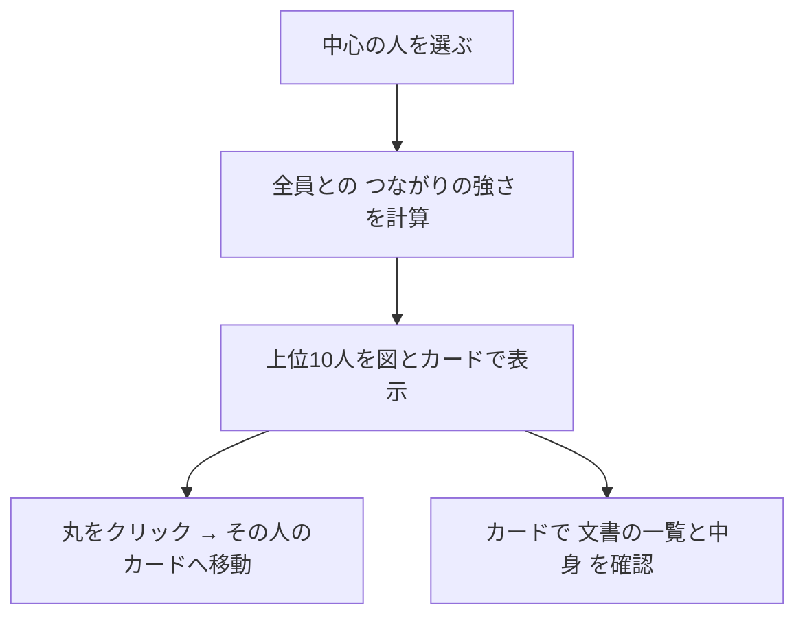

# つながりマップ

選んだ人を中心に、**つながりの強い人**を図で見せる。丸が人、線が関係。線が太く短いほど強い。



## つながりの強さ

```
強さ ＝ 看板 ＋ テーマ ＋ 文章 ＋ 知っている度
```

| 項目 | 中身 | 重み（中央） |
|---|---|---|
| 看板の近さ | 看板（非公開メモ）のベクトルの近さ | 0.35 |
| テーマの近さ | 文書のキーワードの近さ（珍しい語ほど重い） | 0.20 |
| 文章の近さ | 文書の本文の語の近さ | 0.15 |
| 知っている度 | 組織の近さ（下表） | 左端 +0.30 ／ 右端 −0.30 |

| 組織の段階 | 共同作業 | 同じ課 | 同じ拠点 | 同じ職能 | 同じ区分 | 別の区分 |
|---|---|---|---|---|---|---|
| 知っている度 | 1.0 | 0.8 | 0.5 | 0.3 | 0.1 | 0 |

## 画面ごとの使い分け

| 画面 | 看板 | 設定 | ねらい |
|---|---|---|---|
| 仲間を探す | 使う | スライダーで調整（新しい出会い ⇔ すでに強い関係、知っている範囲、人数） | 関心・意欲が近い人と出会う |
| 人を探す | 使わない | 固定（強い関係／同じ課まで） | 実績を事実で確かめる |
| 属人化マップ | 使わない | 固定（強い関係／共同作業のみ） | 引き継ぎ候補の接点を見る |

## 図の見方

| 表示 | 意味 |
|---|---|
| 丸の色 | 中心の人との組織の近さ（青＝知っている、橙＝新しい） |
| ◆ | 意外なつながり（関心は近いが、文書では接点が薄い） |
| 実線 | 共同作業 |
| 紫の点線 | 看板（関心）が近い |
| 灰色の点線 | 文書のテーマ・文章が近い |

## 看板の扱い

- 看板は点数にだけ使い、**中身（語・文）は画面に出さない**
- 「共通する語」は、公開された文書のキーワードだけ

## カードで分かること

- 文書の件数（完了PJ・採択提案・ほか）と、得意なテーマ
- その人が紐づく文書の一覧（共同作業した文書に★）。「中身を見る」で読める
- 「この人についてもっと調べる」で、AIの紹介文
