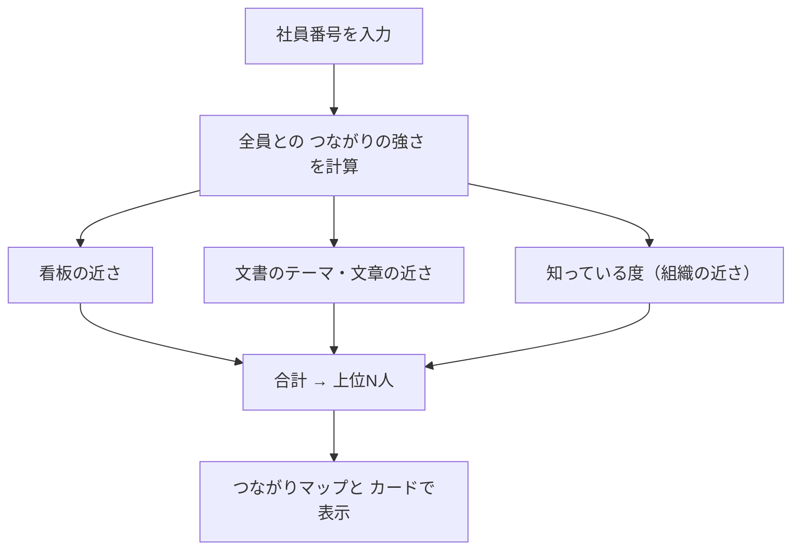

# 仲間を探す

社員番号を入れると、**関心が近く、新しい出会いになる人**を、つながりマップで見せる機能。
「人を探す」が相談から探す能動的な検索なのに対し、自分に近い人が自然に見つかる、受動的な使い方を想定している。



## 点数

```
つながりの強さ ＝ 看板 ＋ テーマ ＋ 文章 ＋ 知っている度
```

| 項目 | 内容 | 重み（中央） |
|---|---|---|
| 看板 | 看板のベクトルの近さ（候補の中央値を0、最大を1にそろえる） | 0.35 |
| テーマ | 文書のキーワードの近さ | 0.20 |
| 文章 | 文書の本文の語の近さ | 0.15 |
| 知っている度 | 共同作業 1.0／同じ課 0.8／同じ拠点 0.5／同じ職能 0.3／同じ区分 0.1／別の区分 0 | 左端 +0.30、右端 −0.30 |

## サイドバーで調整できるもの

| 項目 | 範囲 | 既定 |
|---|---|---|
| つながりの重視 | すでに強い関係 ⇔ 新しい出会い | 中央 |
| 知っている範囲 | 同じ課／拠点／職能／区分まで | 同じ拠点まで |
| 表示する人数 | 5〜15人 | 10人 |

## 意外なつながり（◆）

看板は近いのに、文書のテーマが遠い人。「知っている範囲」の外にいる人だけに付く。文書では接点がない、関心の重なり。

## 画面に出るもの

| 項目 | 内容 |
|---|---|
| つながりマップ | 丸の色＝組織の近さ。丸をクリックで、その人のカードへ |
| 点数の内訳 | 看板・テーマ・文章・知っている度 |
| この人のナレッジ | 文書の件数、得意なテーマ、紐づく文書（中身を読める） |
| この人についてもっと調べる | AIの紹介文（押したときだけ） |

看板の中身そのものは出さない（看板は非公開のメモ）。

## 注意

- 看板も文書もない人は、つながりを描けない
- 重みは初期値。本物のDBで調整する
