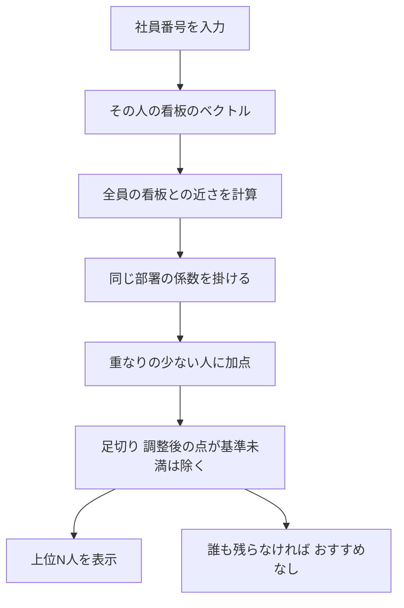

# 仲間を探す

社員番号を入れると、**看板が近い人（考え方や関心が似ている人）** が見つかる機能。
「人を探す」が相談から探す能動的な検索なのに対し、こちらは自分に近い人が自然に見つかる、受動的な使い方を想定している。

## 流れ



## 点数

```
調整後の点 ＝ 近さ × 同じ部署の係数 × (1 ＋ 加点の強さ × 重なりの少なさ)
```

| 項目 | 内容 |
|---|---|
| 近さ | 看板のベクトル同士のコサイン類似度（0〜1。大きいほど近い） |
| 同じ部署の係数 | 同じ部署の人の点に掛ける。そのまま／×0.6／×0.3 |
| 重なりの少なさ | 1 − 2人が関わった文書の重なり。同じ文書に関わっていない人ほど大きい |
| 足切り | 調整後の点が基準未満の人は出さない |

## サイドバーで調整できるもの

| 項目 | 範囲 | 既定 |
|---|---|---|
| 足切り（調整後の点の最低ライン） | 0〜1 | 0.50 |
| 出す人数の上限 | 1〜20人 | 5人 |
| 同じ部署の人の点数 | そのまま／×0.6／×0.3 | ×0.3 |
| 重なりの少ない人への加点 | 0〜2 | 0（加点なし） |

「全社の2人組の近さ」の分布を、足切りを決める目安として画面に出す。

## 画面に出るもの

| 項目 | 内容 |
|---|---|
| この人のナレッジ | 選んだ人の文書（中身はポップアップ）とキャリアシートの本文 |
| 点数の内訳 | 調整後の点＝近さ×係数。同じ部署か、文書の重なり、共通する語 |
| 紐づくナレッジ | 各人の文書とキャリアシートの項目。★は選んだ人も関わっている文書 |
| 中身を見る | 文書の中身を、ポップアップで読める |
| この人についてもっと調べる | 看板をもとに、AIが紹介を書く（押したときだけ） |

看板の中身そのものは出さない（看板は非公開のメモ）。

## 注意

- 看板がない人（文書もキャリアシートもない人）は、仲間を探せない。
- 看板が薄い人は、近さの信頼性が下がる。
- 足切りの既定値は仮。実データの近さの分布を見て決める。
- キャリアシートは、今はモックの文章。
