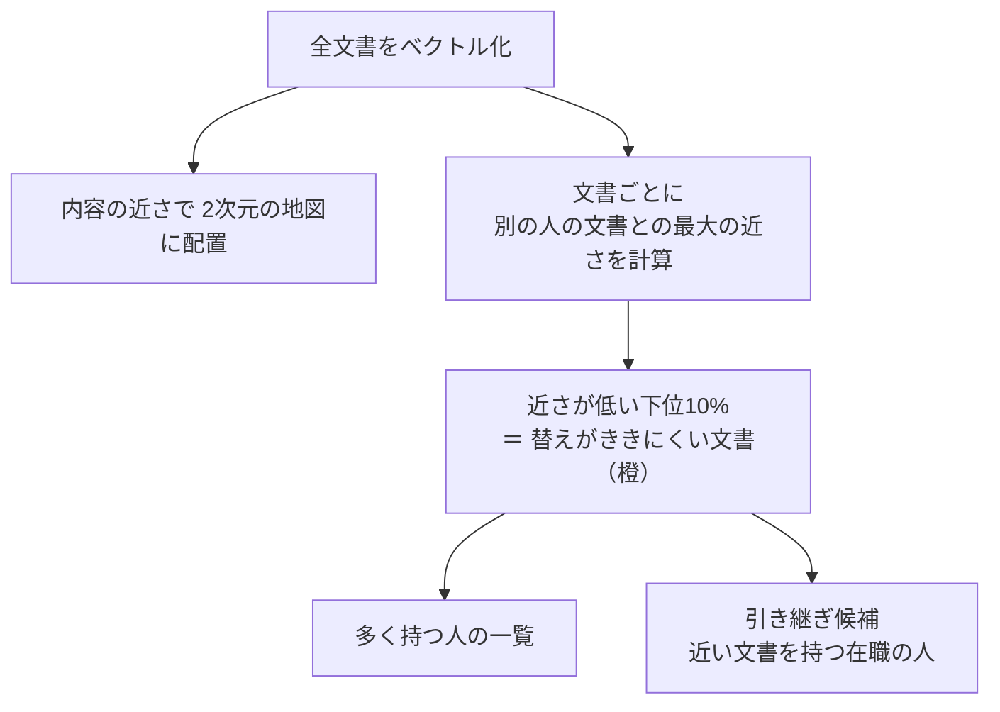

# 属人化マップ

**「この経験を持つのは、この人だけ」** の文書を見つける。書いた人が異動・退職すると、社内から見えなくなりやすい経験。

## 見方

| 項目 | 内容 |
|---|---|
| 橙の点 | 他の人の文書に、似たものが見当たらない文書 |
| 人の一覧 | 橙の文書を多く持つ人。在職／退職／異動あり |
| 引き継ぎ候補 | その人の文書に内容が近い文書を、別に持つ在職の人 |
| つながりマップ | 引き継ぎ候補と、その人の周りの接点を見る（事実だけで描く） |

## 調整できるもの

| 項目 | 範囲 | 既定 |
|---|---|---|
| 「替えがききにくい」とみなす割合 | 2〜30% | 10% |
| 退職・異動した人が関わる文書だけ見る | オン／オフ | オフ |

## 注意

- 文書単位で見る。1人が書く文書は少なく、テーマ単位では偏りが出ない
- 「同じ経験」とは限らない。引き継ぎの相談相手を探す目安
