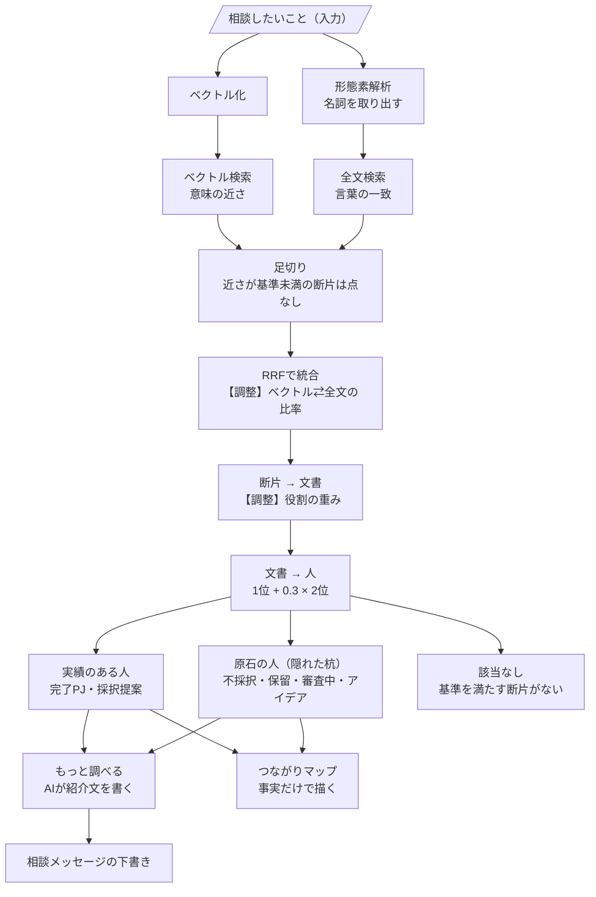

# 検索アルゴリズム

| 項目 | 説明 |
|---|---|
| ベクトル検索 | 質問と意味が近い文書の断片を探す |
| 形態素解析 | 質問と文書を、名詞の語に分ける（SudachiPy） |
| 全文検索 | 質問の語と同じ言葉を含む断片を探す |
| 足切り | ベクトルの近さ 0.50 未満、全文のスコア 8 未満の断片には、点を付けない。範囲外の質問は「該当なし」になる |
| RRF統合 | 2つの検索の「順位」を合算。点数の絶対値ではなく、順位で比べる |
| 役割の重み | 提案者・主担当ほど、その文書の知見を持つ人として重く扱う（提案者・主担当 1.0 ／ 副担当 0.6 ／ 責任者 0.3） |
| 文書 → 人 | 人に紐づく文書の点から、人の点を作る。1位 ＋ 0.3 × 2位（最も合う文書を主役に、2つ目は補助点。文書数の多い人が有利にならない） |

## 順位づけに使わないもの

- **看板（非公開メモ）は、順位づけに使わない。** 使うのは、人を選んだあとの「もっと調べる」と「仲間を探す」だけ
- 順位は、文書という事実だけで決まる

## 人を選んだあとの機能

| 機能 | 内容 |
|---|---|
| もっと調べる | 看板と、質問に当たった文書の章から、AIが出典つきの紹介文を書く |
| 相談メッセージの下書き | 紹介文の出典つきの経験だけを材料に、依頼文を書く。材料にない文書番号を含む文は除く |
| つながりマップ | その人の周りの、実績で裏づけられた人を図で見る（看板は使わない） |

## 確かめ方

テーマ別36問で既定値を決めた（ベクトル 0.50／全文 8）。範囲内30問はすべて結果が出て、範囲外6問のうち5問が「該当なし」になる。
