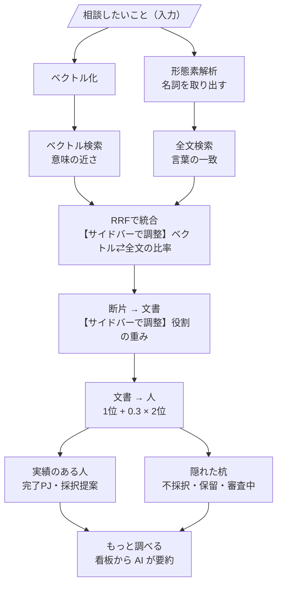

# 検索アルゴリズム

| 項目 | 説明 |
|---|---|
| ベクトル検索 | 質問と意味が近い文書の断片を探す |
| 形態素解析 | 質問と文書を、名詞の語に分ける（SudachiPy） |
| 全文検索 | 質問の語と同じ言葉を含む断片を探す |
| RRF統合 | 2つの検索の「順位」を合算。点数の絶対値ではなく、順位で比べる |
| 役割の重み | 提案者・主担当ほど、その文書の知見を持つ人として重く扱う（提案者・主担当 1.0 ／ 副担当 0.6 ／ 責任者 0.3） |
| 文書 → 人 | 人に紐づく文書の点から、人の点を作る。1位 ＋ 0.3 × 2位（最も合う文書を主役に、2つ目は補助点。文書数の多い人が有利にならない） |
