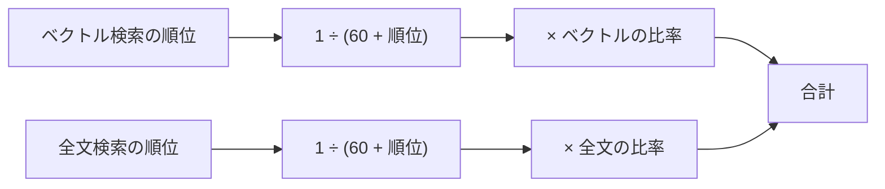

# 点数の見方

```
合計 0.0159 ＝ ベクトル 0.0078 ＋ 全文 0.0081
```

| 数字 | 意味 |
|---|---|
| **ベクトル 0.0078** | 質問と「意味が近い」順位から出た点 |
| **全文 0.0081** | 質問と「言葉が一致する」順位から出た点 |
| **合計 0.0159** | 上の2つの足し算。人の点数 |

## 点数の作り方



| 順位 | 1位 | 2位 | 5位 | 10位 | 50位 |
|---|---|---|---|---|---|
| 1 ÷ (60＋順位) | 0.0164 | 0.0161 | 0.0154 | 0.0143 | 0.0091 |

- 比率は既定でベクトル 0.5／全文 0.5（サイドバーで変更可）。
- 比率 0.5 のとき、片方の検索で1位でも 0.0082 が上限。
- 両方で1位なら約 0.0164。人の点数は上位2文書を足すので、上限はおよそ 0.02。

## 読み方

- 点数は「順位」から作った値で、類似度そのものではない。大きいほど上位に出た。
- 0.0159 は、両方の検索で上位に入った人。
- 片方が 0.0000 の人は、その検索の上位100件に入らなかった人。

## 「60」について（RRFの定数 k）

```
点 ＝ 1 ÷ (k ＋ 順位)　　このアプリでは k ＝ 60
```

- 60 は固定値。RRF の原論文で使われた標準的な値で、多くの実装が既定にしている。
- k は「上位の順位をどれだけ優遇するか」を決める。

| k | 1位と10位の点の比 | 性質 |
|---|---|---|
| 小さい（例：10） | 約1.8倍 | 上位を強く優遇する |
| 60 | 約1.15倍 | 順位の差をなだらかにする |
| 大きい（例：200） | 約1.05倍 | ほぼ横並びになる |

- k を変えると点の大きさは変わるが、1つの検索の中の並びは変わらない。
- 60 は、どんな質問でも極端な偏りが出にくい無難な値。
