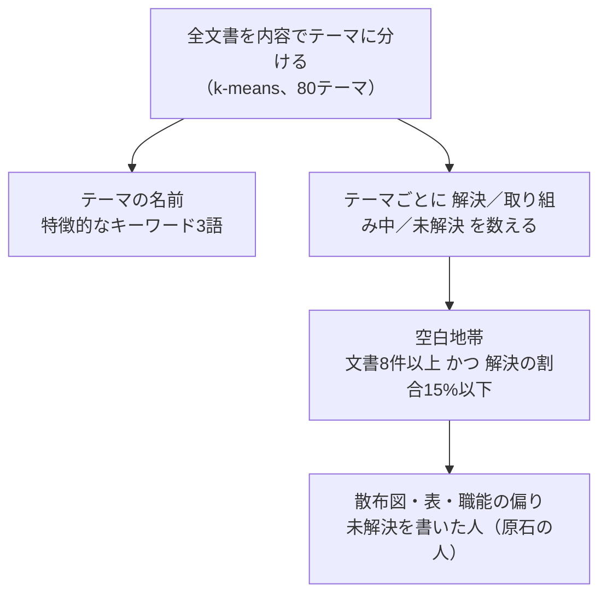

# 空白地帯マップ

**「困りごとはあるのに、解決した経験が社内にない」** テーマを見つける。

## 文書の状態

| 状態 | 対象 |
|---|---|
| 解決 | 採択された提案、完了したPJ |
| 取り組み中 | 進行中・計画中のPJ、審査中の提案 |
| 未解決 | アイデア投稿、不採択・保留の提案、中止したPJ |

## 見方

| 項目 | 内容 |
|---|---|
| 散布図 | 横＝解決、縦＝未解決、大きさ＝文書数。**左上**が空白地帯 |
| 表 | テーマごとの件数と解決の割合 |
| 職能の偏り | どの職能が、そのテーマの未解決を抱えているか |
| テーマの中身 | 未解決の文書を書いた人（＝原石の人）と、解決した文書 |

## 調整できるもの

| 項目 | 既定 |
|---|---|
| 文書の件数（以上） | 8件 |
| 解決の割合（以下） | 15% |

## 注意

- 数字は文書が増えると変わる。基準は画面で動かせる
